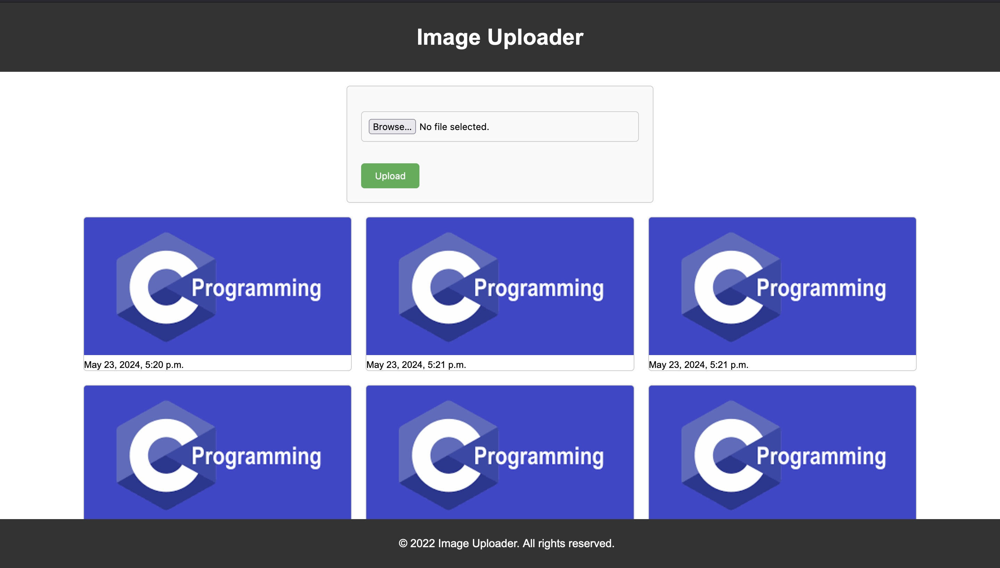

# Image Uploader - Django Project

## Overview

Image Uploader is a Django-based web application that allows users to upload, view, and manage images. This project demonstrates basic Django functionality, including form handling, file uploads, and media file management.

## Features

- User-friendly interface for image uploading
- Displays a gallery of uploaded images
- Supports multiple image formats using Pillow
- Uses Django's built-in user authentication
- Media files management

## Requirements

- Python 3.10+
- Django 5.0.6
- Pillow 10.3.0
- asgiref 3.8.1
- sqlparse 0.5.0

## Installation

1. **Clone the repository:**
    ```bash
    git clone https://github.com/SudeepAcharjee/Image-Uploader
    cd image-uploader
    ```

2. **Create and activate a virtual environment:**
    ```bash
    python3 -m venv env
    source env/bin/activate   # On Windows use `env\Scripts\activate`
    ```

3. **Install the dependencies:**
    ```bash
    pip install -r requirements.txt
    ```

## Configuration

1. **Apply migrations:**
    ```bash
    python manage.py migrate
    ```

2. **Create a superuser (admin):**
    ```bash
    python manage.py createsuperuser
    ```

3. **Run the development server:**
    ```bash
    python manage.py runserver
    ```

4. **Access the application:**
    Open your web browser and go to `http://127.0.0.1:8000`

## Usage

1. **Upload Images:**
    - Navigate to the upload page.
    - Select an image file and submit the form.
    - The image will be saved and displayed in the gallery.

2. **View Gallery:**
    - View the gallery page to see all uploaded images.

## Screenshot

Below is a screenshot of the image uploader application:



## Dependencies

- **asgiref==3.8.1**
- **Django==5.0.6**
- **pillow==10.3.0**
- **sqlparse==0.5.0**

## License

This project is licensed under the MIT License. See the [LICENSE](LICENSE) file for details.

## Acknowledgements

Special thanks to the Django and Pillow communities for their excellent documentation and support.

## Contact

For any questions or feedback, please contact [sudeepacharjeegp@gmail.com](mailto:sudeepacharjeegp@gmail.com).

